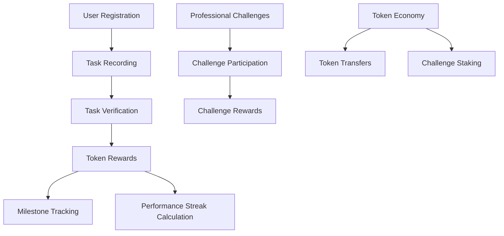

# High-Performance Work Cleaner

High-Performance Work Cleaner is a blockchain-powered work performance tracking system that motivates professionals to maintain consistent productivity through token rewards, milestones, and collaborative challenges.

## Overview

High-Performance Work Cleaner creates a gamified work performance ecosystem by:
- Rewarding users with tokens for completing verified work tasks
- Increasing rewards based on performance streaks and task complexity
- Offering milestone achievements with bonus rewards
- Enabling collaborative challenges with stake-based competitions
- Managing a token economy for professional productivity

## Architecture

The system is built around a core smart contract that handles:



Core components:
- User profiles with task history and performance statistics
- Task verification system with authorized validators
- Token reward calculation based on performance streaks and task complexity
- Milestone achievement system
- Professional challenges with staking mechanism

## Contract Documentation

### Performance Tracker Contract

The main contract (`performance-tracker`) manages all core functionality:

#### Key Features
- User registration and profile management
- Task recording and verification
- Token minting and distribution
- Performance streak tracking and bonus calculations
- Milestone achievement system
- Professional challenge management

#### Access Control
- Contract owner: Can manage validators and end challenges
- Authorized validators: Can verify tasks and create challenges
- Users: Can record tasks, join challenges, and transfer tokens

## Getting Started

### Prerequisites
- Clarinet
- Stacks wallet for deployment

### Basic Usage

1. Register as a professional:
```clarity
(contract-call? .performance-tracker register-user)
```

2. Record a work task:
```clarity
(contract-call? .performance-tracker record-task u120 "project-development")
```

3. Get user profile:
```clarity
(contract-call? .performance-tracker get-user-profile tx-sender)
```

## Function Reference

### User Management
- `register-user()`: Register a new professional
- `get-user-profile(principal)`: Get user's performance profile

### Task Management
- `record-task(uint, string-ascii)`: Record a new work task
- `verify-task(principal, uint)`: Verify a completed task
- `get-task(principal, uint)`: Get task details

### Token Operations
- `get-token-balance(principal)`: Check token balance
- `transfer-tokens(principal, uint)`: Transfer tokens to another user

### Challenges
- `create-challenge(string-ascii, string-utf8, uint, uint, uint)`: Create new challenge
- `join-challenge(uint)`: Join an existing challenge
- `record-challenge-task(uint, uint)`: Record task for challenge

## Development

### Testing
1. Clone the repository
2. Run Clarinet console:
```bash
clarinet console
```
3. Execute test commands:
```clarity
(contract-call? .performance-tracker register-user)
```

### Local Development
1. Install Clarinet
2. Initialize project:
```bash
clarinet new high-performance-work-cleaner
```
3. Copy contract code to `contracts/performance-tracker.clar`

## Security Considerations

### Limitations
- Task verification relies on authorized validators
- Challenge rewards are distributed after challenge completion
- Token transfers are irreversible

### Best Practices
- Only use authorized validators for task validation
- Verify challenge parameters before joining
- Maintain sufficient token balance for challenge participation
- Be aware of challenge deadlines and conditions